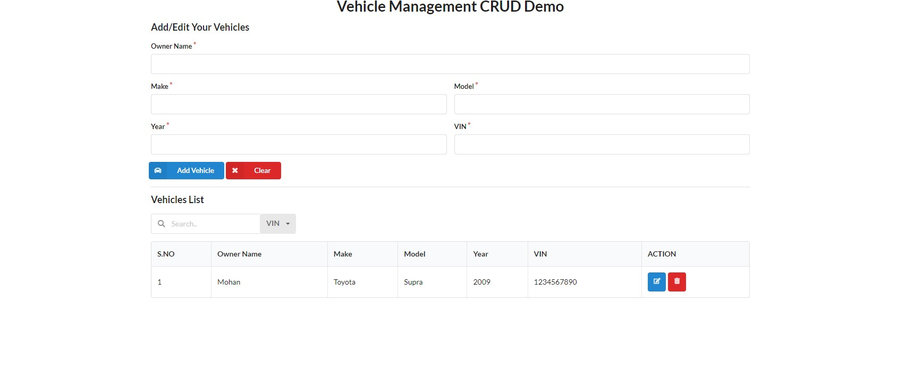

# Vehicle Management CRUD Demo

This project is a demo for a Vehicle Management system implemented with Spring Boot and React.

## Introduction

This project demonstrates a basic CRUD (Create, Read, Update, Delete) and Search application for managing vehicle records. It features a RESTful API backend developed with Spring Boot and a frontend interface built using React.



## Prerequisites

- Java Development Kit (JDK)
- Node.js and npm
- Spring Boot
- React

## Installation

1. Clone the repository:

   ```bash
   git clone https://github.com/your-username/vehicle-management.git
   ```
2. Install backend dependencies:
    ```bash
   ./gradlew build
    ```
3. Start backend spring server
   ```bash
   java -jar build/libs/management-0.0.1-SNAPSHOT.jar
   ```
4. Install frontend dependencies:
    ```bash
    cd src/main/webapp
    npm install
    ```
5. Start the frontend development server:
   ```bash
    npm start
   ```
   [Refer React Document](src/main/webapp/README.md)

